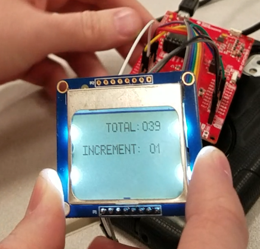
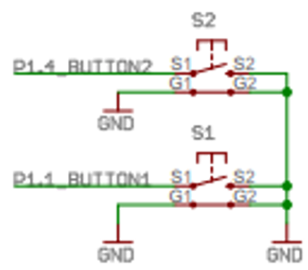
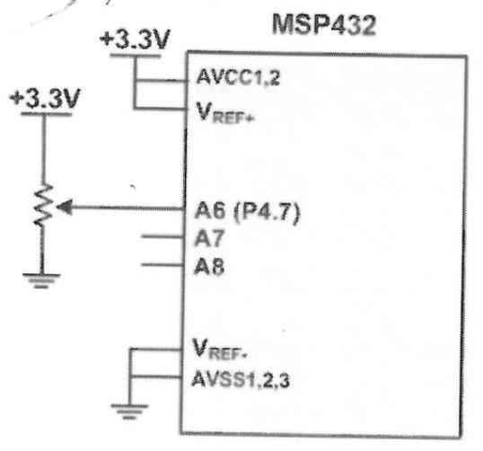
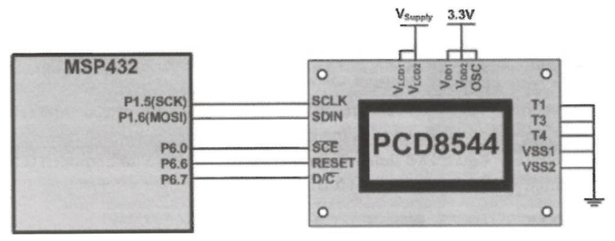

Dale Andreoli

and17081@byui.edu

Team project with Gonzalo Martinez

# Digital Score Counter

[Video Demonstration](https://youtu.be/mWlVXtwE6LU)

## Program Specifications

This project shows an understanding of the following concepts:

* ADC (potentiometer)
* I/O (switches)
* Display (GLCD)

## Program Description

This project is designed to count in various increments. It can be used to keep score in games or any application where a count is needed. 

A potentiometer is used to select the amount by which to increment to total. Switches are used to increment or decrement the total by the selected amount. An LCD screen displays both the total and the currently selected increment value.

## Connections (Wiring Schematic)

SW1 is connected to P1.1
SW2 is connected to P1.4

Potentiometer is connected to P4.7

The PCD8544 GLCD is connected as shown below.  

NOTE: There is only one VCC and only one GND connection on the display.  All of the shown voltages and grounds are connected internally on the board.

## Test Plan and Results

To test our program, we will make sure our potentiometer is properly converted from an analog value to one of our three increment options. We will test our switches to make sure the Switch 1 increment the total by the selected value while Switch 2 decrements by the selected value. We will test our display by making sure all elements are properly displayed.

Our program successfully converts the value of our potentiometer into the appropriate increment value. Our switches properly increment and decrement the total with accurate debouncing and input delays. Switch 1 increments the total while Switch 2 decrements the total. Our display neatly outputs the current total and the currently selected increment value with aesthetic white space to make it more readable

The biggest struggle for this project was properly converting our potentiometer position into the proper increment value.

## [Code - Click here to view](score_counter.c)